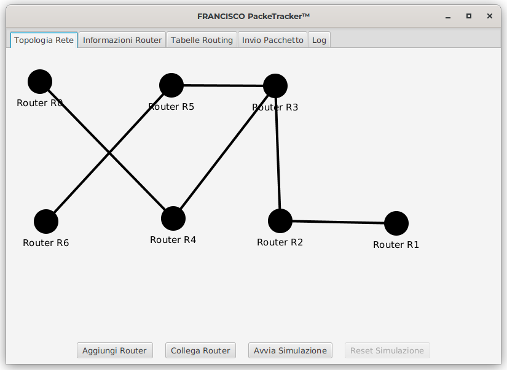
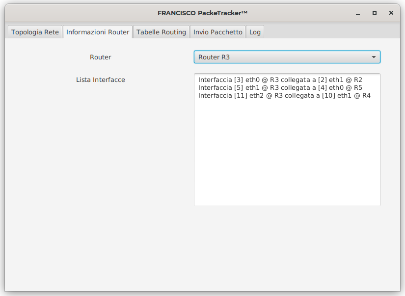
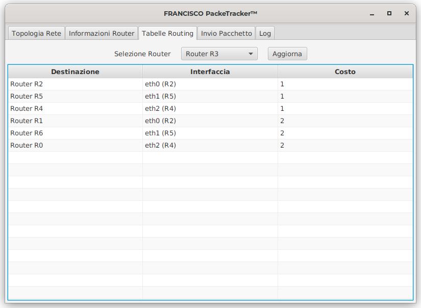
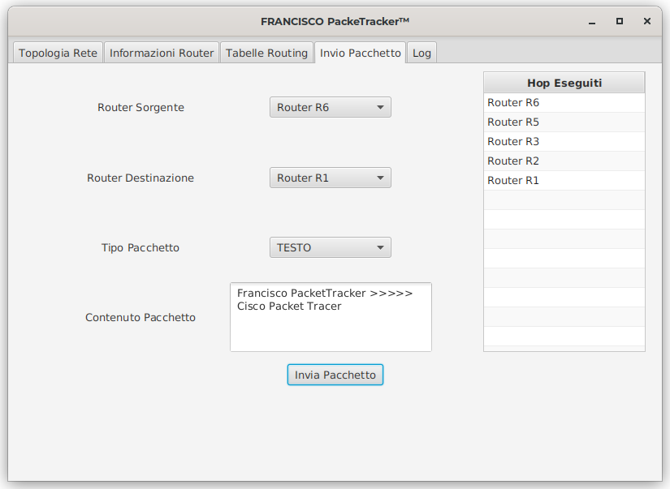
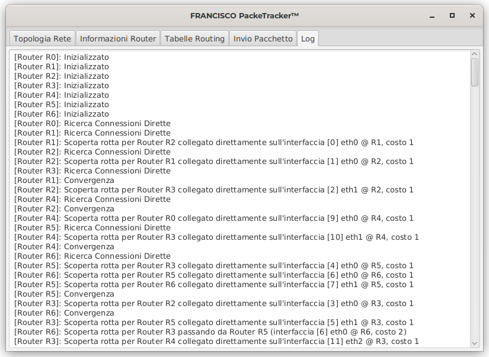

# Routing - Progetto Sistemi A/S 2021-2022
### Francisco PackeTracker

## Componenti del Gruppo
- Moioli Jacopo
- Moioli Jacopo
- Moioli Jacopo
- Moioli Jacopo

## Funzionamento
Il programma simula una rete composta da `Router`.
Ogni router è composto da una lista di `Interfacce`, le quali permettono il `Collegamento` tra i router.

Ogni router ha una `TabellaRouting` all'interno della quale sono salvate delle `Rotte` che permettono l'instradamento di un `Pacchetto` verso una destinazione finale.
La tabella di routing viene popolata attraverso un algoritmo simile a Bellman-Ford: ogni router condivide la propria tabella di routing con i router adiacenti, ottenendo alla fine la convergenza totale.

## Interfaccia Utente
### Topologia Rete

Permette la visualizzazione della rete, l'aggiunta dei router, la creazione dei collegamenti e l'avvio della simulazione
### Informazioni Router

Permette di visualizzare le interfacce di ciascun router
### Tabelle Routing

Permette di visualizzare la tabella di routing, aggiornata in tempo reale, di ogni router della rete
### Invio Pacchetto

Permette di inviare un pacchetto da un router all'altro, e vedere la lista dei router da cui il pacchetto è transitato
### Log

Permette di visualizzare il log